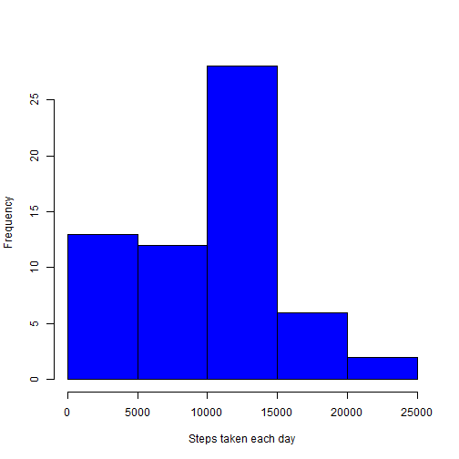
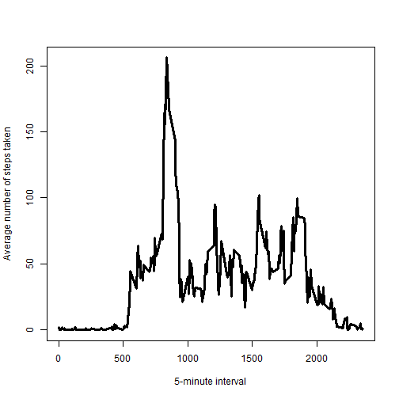
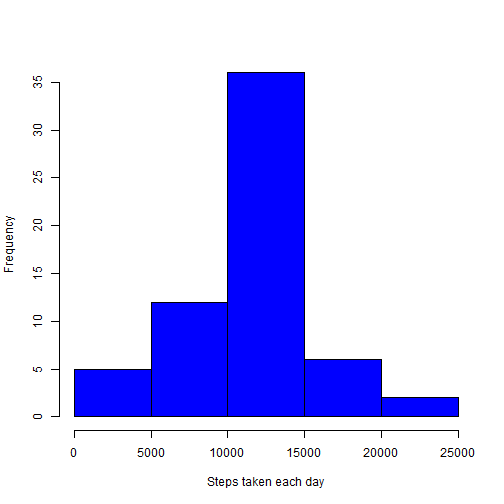
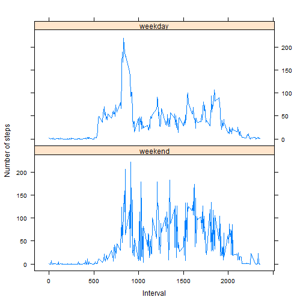

# Reproducible Research: Peer Assessment 1


## Loading and preprocessing the data

- Unzip and load the activity data

```r
data <- read.csv(unz("activity.zip", "activity.csv"), header = TRUE)
```

- Transform class of the date variable using as.Date function and class of the interval variable into factor 

```r
data$date <- as.Date(data$date)
data$interval <- as.factor(data$interval)
```

- Calculate total number of steps taken each day and put into a new data frame


```r
sum <- data.frame(sum_steps = tapply(data$steps, data$date, sum, na.rm = TRUE))
```

## What is mean total number of steps taken per day?

- Make a histogram of the total number of steps taken each day

```r
hist(sum$sum_steps, col = "blue", xlab = "Steps taken each day", main = NULL)
```

 

- Calculate and report the mean and median total number of steps taken each day

```r
mean <- mean(sum$sum_steps)
median <- median(sum$sum_steps)
```
The mean and median total number of steps taken each day are 9354.2295 and 10395, respectively.

## What is the average daily activity pattern?

- Make a time series plot of the 5-minute interval (x-axis) and the average number of steps taken, averaged across all days(y-axis)

```r
mean_interval <- data.frame(mean_interval = tapply(data$steps, data$interval, mean, na.rm = TRUE))
plot(rownames(mean_interval), mean_interval$mean_interval, type = "l", lwd = 3, 
     xlab = "5-minute interval", ylab = "Average number of steps taken", main = NULL)
```

 

- Which 5-minute interval, on average across all the days in the dataset, contains the maximum number of steps?

```r
max <- names(which.max(mean_interval$mean_interval))
```
The 835 5-minute interval, on average, contains the maximum number of steps.

## Imputing missing values

- Calculate and report the total number of missing values in the dataset

```r
na_num <- sum(is.na(data$steps))
```
The total number of rows with NAs is 2304.

- Devise a strategy for filling in all of the missing values in the dataset

I am going to use the mean for a specific 5-minute interval to fill in missing values of that interval.

- Create a new dataset that is equal to the original dataset but with the missing data filled in

```r
new_data <- data
for (i in which(is.na(new_data$steps))) {
        new_data[i, 1] <- mean_interval[rownames(mean_interval) == new_data[i, 3], ]
}
```

- Make a histogram of the total number of steps taken each day and calculate and report the mean and median total number of steps taken per day. Do these values differ from the estimates from the first part of the assignment? What is the impact of imputing missing data on the estimates of the total daily number of steps?

```r
new_sum <- data.frame(sum_steps = tapply(new_data$steps, data$date, sum))
hist(new_sum$sum_steps, col = "blue", xlab = "Steps taken each day", main = NULL)
```

 

```r
new_mean <- mean(new_sum$sum_steps)
new_median <- median(new_sum$sum_steps)
```
The mean and median total number of steps taken each day after imputation are 1.0766 &times; 10<sup>4</sup> and 1.0766 &times; 10<sup>4</sup>, respectively. These values differ from the previous estimates. The estimates increase in magnitude and become more normalized after imputation.

## Are there differences in activity patterns between weekdays and weekends?

- Create a new factor variable in the dataset with two levels - "weekday" and "weekend" indicating whether a given date is a weekday or weekend day.

```r
new_data$day <- weekdays(new_data$date)
index <- new_data$day == c("Saturday", "Sunday")
new_data[index, 4] <- "weekend"
new_data[!index, 4] <- "weekday"
new_data$day <- as.factor(new_data$day)
```

- Make a panel plot containing a time series plot of the 5-minute interval (x-axis) and the average number of steps taken, averaged across all weekday days or weekend days (y-axis).

```r
library(lattice)
new_mean_interval <- rbind(data.frame(mean_interval = tapply(new_data[index, 1], new_data[index, 3], mean), 
                                      interval = as.numeric(levels(new_data$interval)), 
                                      day = "weekend"), 
                           data.frame(mean_interval = tapply(new_data[!index, 1], new_data[!index, 3], mean), 
                                      interval = as.numeric(levels(new_data$interval)), 
                                      day = "weekday"))
xyplot(mean_interval ~ interval | day, data = new_mean_interval, 
       layout = c(1, 2), type = "l", xlab = "Interval", ylab = "Number of steps")
```

 
